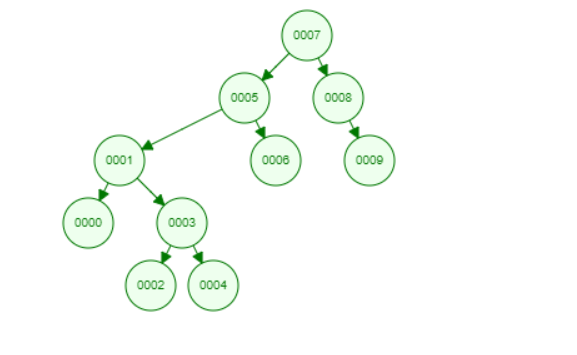

# Binary Search Tree Project

1. Write the steps for the given record using Binary Search Tree:

- [How to Construct a Binary Search Tree](https://www.youtube.com/watch?v=FvdPo8PBQtc)

  - [7,5,1,8,3,6,0,9,4,2]

  - 

> Step 1: Insert 7. 7 is our root.

> Step 2: Insert 5. 5 is less than 7, so insert it as the root node of the left subtree.

> Step 3: Insert 1. 1 is less than 5 and 7, so it will be inserted as a left subtree of 5.

> Step 4: Insert 8. 8 is greater than 7, so insert it as the root node of the right subtree.

> Step 5: Insert 3. 3 is less than 5 and 7 but greater than 1, so it will be inserted as the right subtree of 1.

> Step 6: Insert 6. 6 is less than 7 and 8 but greater than 5, so it will be inserted as the right subtree of 5.

> Step 7: Insert 0. 0 is less than 8, 7, 6, 5, 3, and 1, so it will be inserted as the left subtree of 1.

> Step 8: Insert 9. 9 is greater than 7 and 8, so it will be inserted as the right subtree of 8.

> Step 9: Insert 4. 4 is less than 5 but greater than 3, so it will be inserted as the right subtree of 3.

> Step 10: Insert 2. 2 is less than 3 but greater than 1, so it will be inserted as the left subtree of 3.
